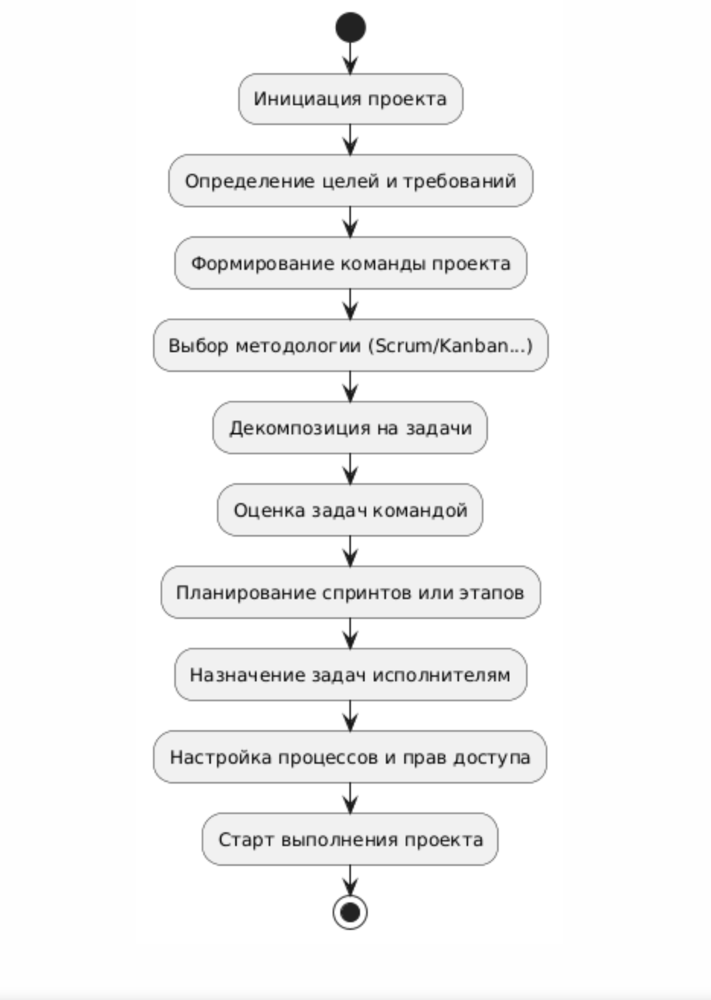
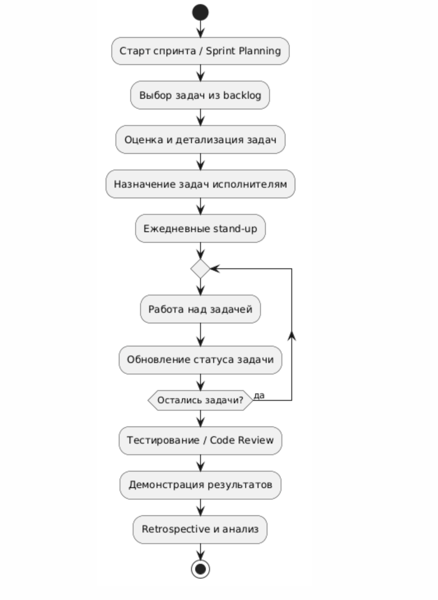
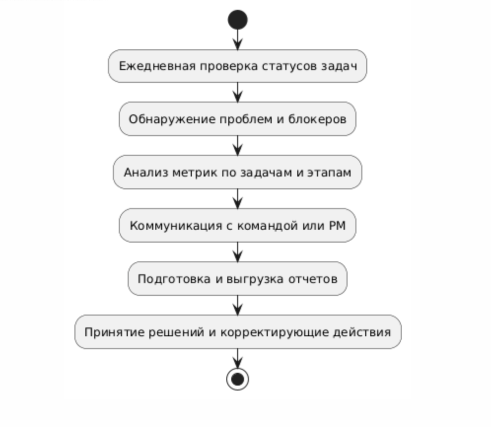

# Диаграммы бизнес-процессов ProjectFlow

В этом разделе представлены основные бизнес-процессы системы управления проектами ProjectFlow. Вся графика реализована в формате PlantUML (см. указанные .puml-файлы).

---

## 1. Процесс создания и планирования проекта
- Диаграмма активности: описание этапов от инициации до запуска первого этапа
- Файл: `diagram_activity_project_creation.puml`

## 2. Процесс ведения спринта/выполнения задач
- Диаграмма активности: планирование, выполнение, мониторинг, ретроспектива
- Файл: `diagram_activity_sprint.puml`

## 3. Процесс аналитики/мониторинга
- Диаграмма активности: ежедневная проверка статусов, анализ метрик, формирование решений
- Файл: `diagram_activity_analytics.puml`

