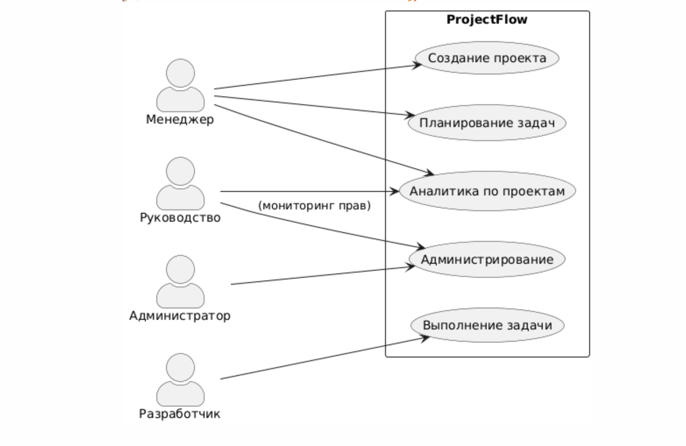

# Диаграммы вариантов использования и сценарии ProjectFlow

---

## Диаграмма вариантов использования

- Раздел содержит основную use case diagram системы (PM, Исполнитель, Админ, Руководство)
- Формат: PlantUML, все связи и действия русским языком
- Файл: `diagram_usecase.puml`

## Подробные сценарии (Given-When-Then)

- Реализованы в отдельном markdown-файле (см. ниже)
- Файл: `usecase_scenarios.md`
- Каждый сценарий расписывает одно из ключевых взаимодействий между участниками системы и самой платформой

(Рекомендается открывать диаграмму и сценарии в паре для лучшего понимания работы ProjectFlow)
