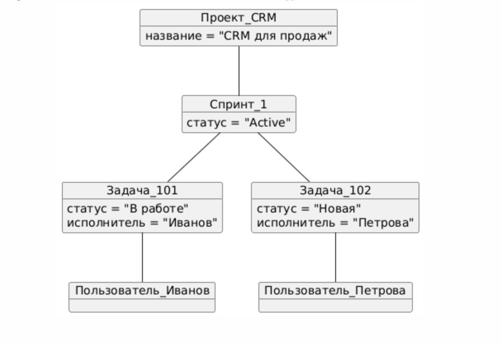

# Диаграммы классов и объектов

---

В набор входят:
- **diagram_klass.puml**: главная диаграмма классов — все ключевые сущности, атрибуты и связи

- **diagram_object_project.puml**: пример связей в реальном проекте (object diagram)

