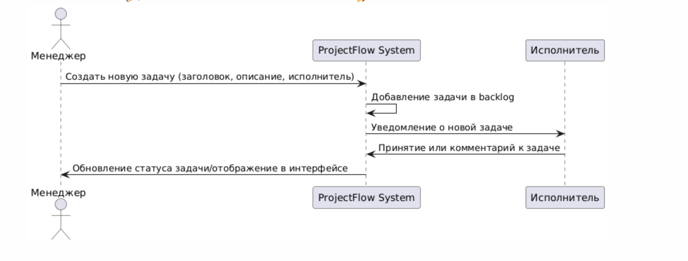
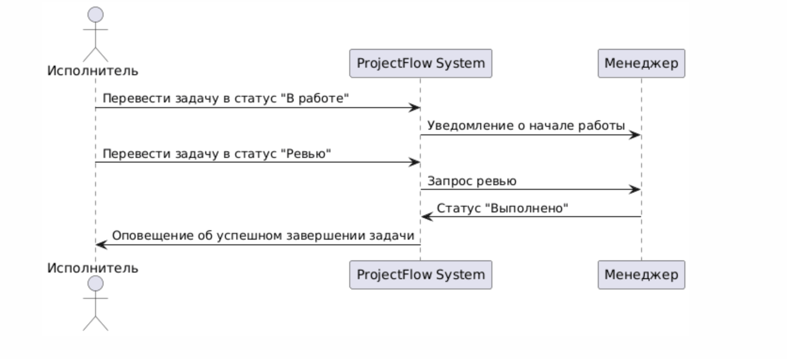
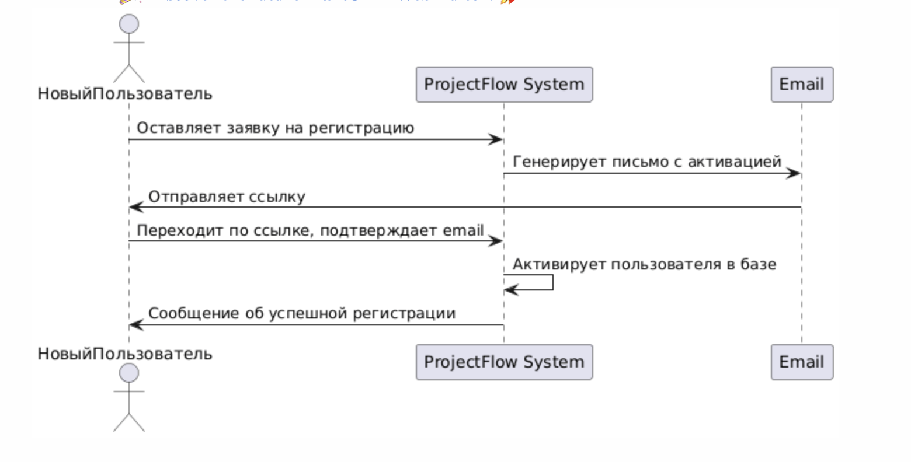
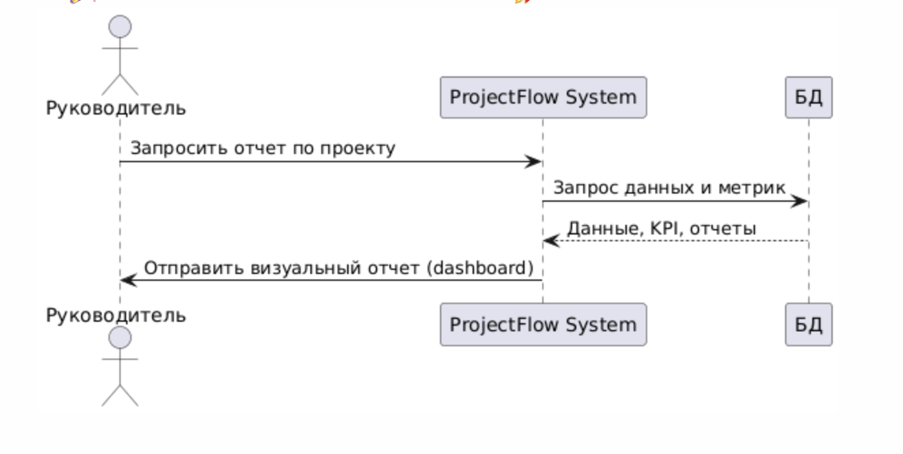
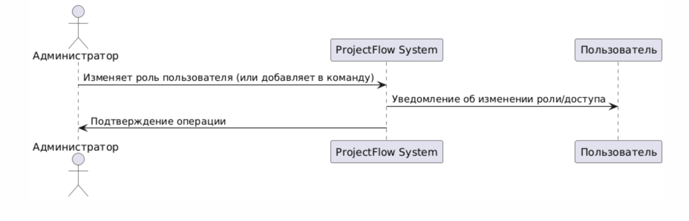
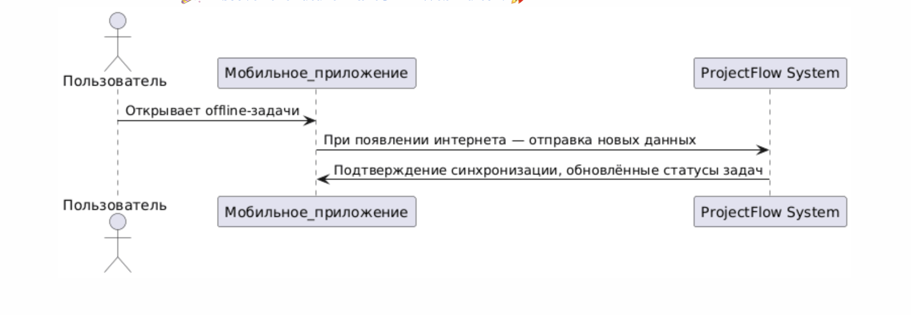

# Диаграммы последовательности (Sequence Diagrams)

---

В комплекте PlantUML-диаграмм представлены сценарии:
- **diagram_sequence_create_task.puml** — создание задачи менеджером, оповещение исполнителя

- **diagram_sequence_task_status_flow.puml** — смена статусов задачи (В работе, Ревью, Выполнено)

- **diagram_sequence_user_registration.puml** — сценарий регистрации и активации пользователя

- **diagram_sequence_analytics_report.puml** — запрос аналитики руководством

- **diagram_sequence_role_management.puml** — администрирование ролей и доступов

- **diagram_sequence_mobile_sync.puml** — синхронизация мобильного клиента при offline/online

