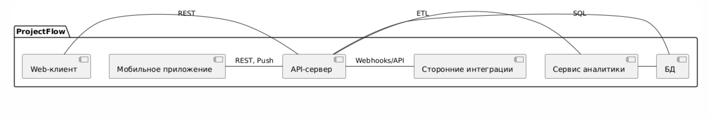
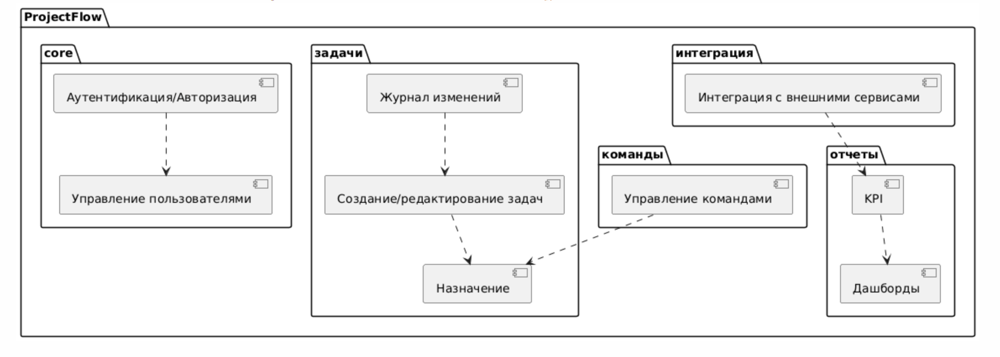
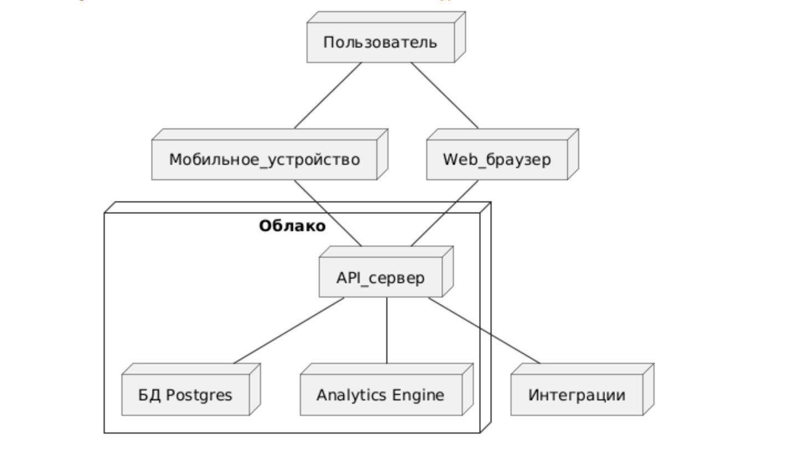

# Диаграммы компонентов, пакетов, развертывания

---

## Компоненты
- **diagram_component.puml** — архитектура обмена данными и взаимодействий между ключевыми частями ProjectFlow: web, mobile, API, БД, аналитика, интеграции.

## Пакеты
- **diagram_package.puml** — логико-модульная декомпозиция приложения по пакетам, структурам, ролям.

## Развертывание
- **diagram_deployment.puml** — схема развертывания, все пользовательские, инфраструктурные, облачные и сторонние подключения.

