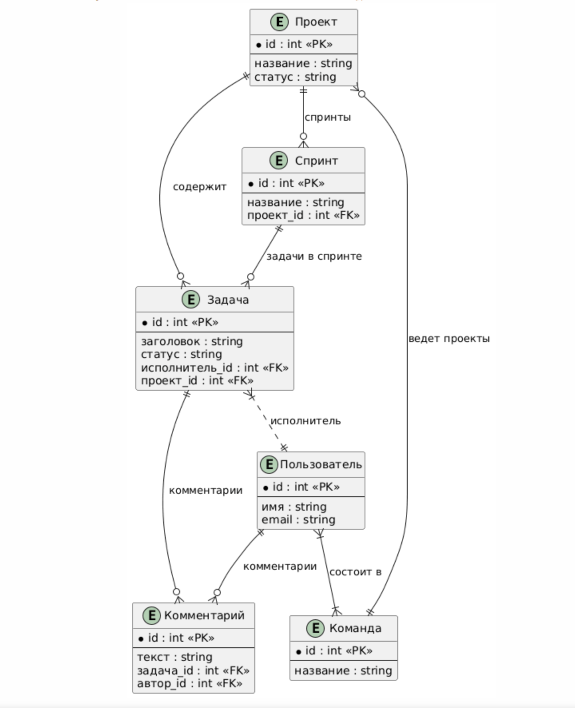
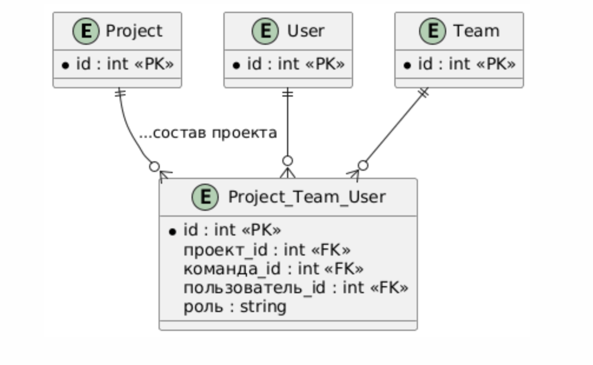

# ERD и ORD схемы базы данных ProjectFlow

---

## ERD (Entity Relationship Diagram) — схема сущностей
- **diagram_erd.puml**
- Описывает структуру и связи между проектами, задачами, пользователями, командами, спринтами и комментариями. Покрывает PK, FK, отношение M:1 и M:N.

## ORD (Object-Relational Mapping)
- **diagram_ord.puml**
- Демонстрирует пример объектно-реляционного отображения M:N отношений через связующую таблицу (Project_Team_User), где участвуют проекты, команды и пользователи (с ролями).

