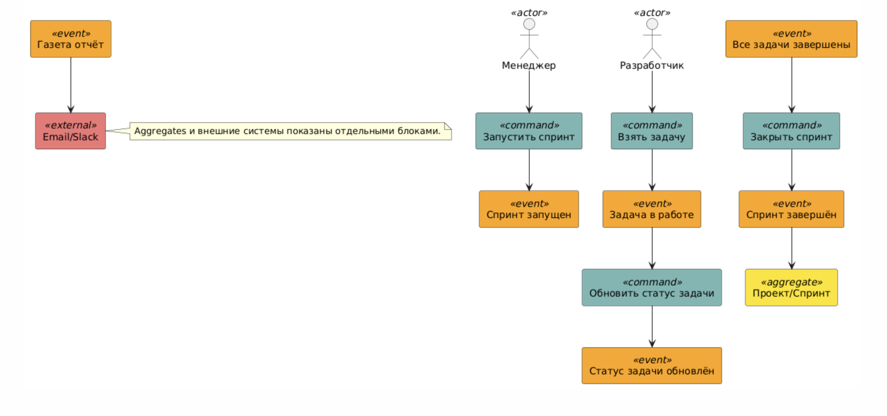
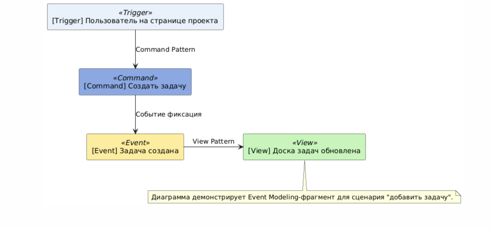

# Event Storming и Event Modeling

---

## Event Storming
- **diagram_eventstorming.puml**

  - Крупномасштабная (Big Picture) EventStorming-диаграмма сценария планирования и ведения спринта: команды, события, агрегаты, внешние системы (email, Slack и т.д.). Цветовая дифференциация stickies, подписи.

## Event Modeling
- **diagram_event_modeling.puml**

  - Показывает сквозной сценарий: от user-триггера (открытие страницы) до команды (создать задачу), события (задача создана) и отражения этого в представлении (view pattern). Использованы стандартные блоки Event Modeling с цветовой маркировкой.

